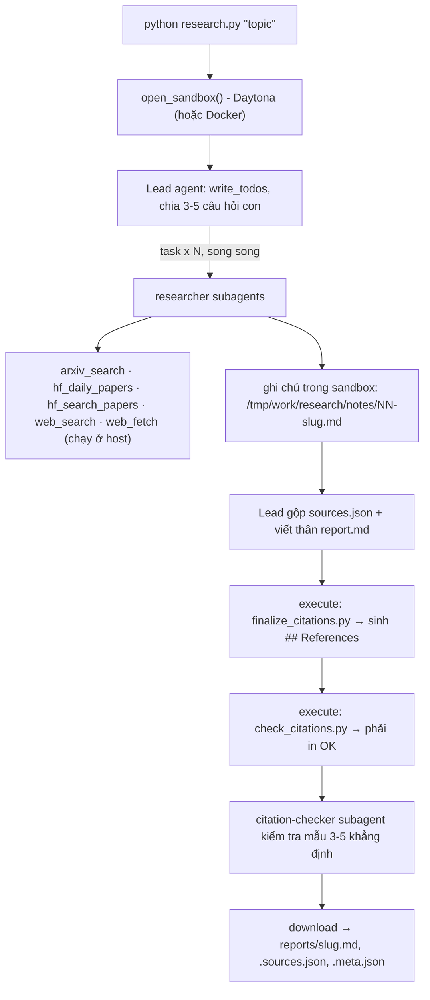

# Deep Research Agent (Deep Agents + Sandbox)

Nhập một chủ đề, ví dụ `survey about world model`. Hệ thống sẽ tự lập kế hoạch, giao việc cho nhiều subagent tìm tài liệu trên arXiv, Hugging Face và web, rồi viết một **báo cáo khảo sát có trích dẫn kiểm chứng được**. Mọi `[n]` trong báo cáo đều trỏ tới một nguồn có thật trong `sources.json`.

Đề bài gốc: [GUIDE.md](GUIDE.md), [RUBRIC.md](RUBRIC.md), [REPORT_TEMPLATE.md](REPORT_TEMPLATE.md).

## Cách hệ thống chạy



| Tệp | Vai trò |
|---|---|
| [tools.py](tools.py) | 5 công cụ nguồn dữ liệu và `with_retry` (backoff lũy thừa, jitter, `Retry-After`, trần `cap`) |
| [agents.py](agents.py) | Prompt của lead, researcher, citation-checker; subagent; giới hạn vòng lặp và chi phí |
| [research.py](research.py) | Script chính: mở sandbox, upload validator và finalizer, chạy agent, tải báo cáo về, ghi `meta.json` |
| [check_citations.py](check_citations.py) | Validator trích dẫn, chạy **trong sandbox** (chỉ dùng thư viện chuẩn) |
| [tests/test_lab.py](tests/test_lab.py) | Test offline, không gọi mạng hay LLM |
| `model.py`, `sandbox.py`, `finalize_citations.py`, `self_check.py` | Có sẵn trong đề, không sửa |

## Cài đặt

Cần Python 3.11 trở lên.

```bash
python3 -m venv .venv && source .venv/bin/activate
pip install -r requirements.txt
cp .env.example .env        # rồi điền khóa của bạn; KHÔNG commit .env (đã có trong .gitignore)
```

Các biến trong `.env`:

| Biến | Bắt buộc | Ghi chú |
|---|---|---|
| `LAB_MODEL` + khóa nhà cung cấp | ✅ | Ví dụ `LAB_MODEL=openai:gpt-4.1-mini` và `OPENAI_API_KEY=...` (các báo cáo trong `reports/` được tạo bằng model này). Dùng Gemini: `google_genai:<model>` và `GOOGLE_API_KEY`. Dùng OpenRouter hoặc endpoint tương thích OpenAI khác: `LAB_BASE_URL` + `LAB_MODEL` + `LAB_API_KEY`. Mô hình phải hỗ trợ tool calling. |
| `DAYTONA_API_KEY` | ✅ (hoặc Docker) | Lấy tại https://app.daytona.io. Không dùng Daytona thì đặt `SANDBOX=docker` để chạy sandbox trong container cục bộ. |
| `EXA_API_KEY` | Nên có | Lấy tại https://dashboard.exa.ai/api-keys. Không có khóa thì bản miễn phí của Exa hết quota rất nhanh. |

Gói miễn phí của các nhà cung cấp LLM thường không đủ: Gemini free chỉ cho 20 request/ngày, trong khi một chủ đề cần khoảng 100–200 lời gọi model.

## Chạy

```bash
python tools.py                                    # thử riêng 5 công cụ với API thật
python research.py "survey about world model"      # chạy một chủ đề (khoảng 4–13 phút)
python self_check.py                               # kiểm tra 5 báo cáo trước khi nộp (không tốn token)
pip install pytest && python -m pytest -q          # test offline
```

Trong lúc chạy, `research.py` in ra stderr từng tool call của lead, cùng kết quả của finalizer và validator. Chạy hỏng (lỗi model, không có báo cáo, `sources.json` hỏng) thì thoát với mã 1 và **không ghi file nào**. Sandbox luôn được dừng và xóa, kể cả khi lỗi.

Các chủ đề chạy độc lập với nhau: muốn chạy lại chủ đề nào thì chỉ cần chạy lại lệnh của chủ đề đó, các báo cáo khác không bị ảnh hưởng.

## Đọc `reports/`

Mỗi chủ đề trong [topics.md](topics.md) có ba tệp, đặt tên theo slug của chủ đề (ví dụ `survey-about-world-model`):

| Tệp | Nội dung |
|---|---|
| `<slug>.md` | Báo cáo tiếng Anh theo [REPORT_TEMPLATE.md](REPORT_TEMPLATE.md): TL;DR, Background, 3–6 phần theo chủ đề, Trends and open problems, References. Mỗi `[n]` trỏ tới dòng `[n]` trong `## References`. |
| `<slug>.sources.json` | Danh sách nguồn `{n, id, url, title, date, source}`. `source` là công cụ đã tìm ra nguồn: `arxiv`, `hf-daily`, `hf-search` hoặc `web`. |
| `<slug>.meta.json` | Bằng chứng của lần chạy: `model`, `elapsed_s`, `subagent_calls` (số lần lead gọi `task`), `tool_calls`, `tokens` (chỉ tin nhắn của lead), `tokens_all` (mọi lời gọi model, gồm cả subagent: đây là chi phí thật), `n_sources`, `source_families`. |

Tệp `.md` và `.sources.json` được ghi **đúng từng byte** như bản tải về từ sandbox, không qua bước sửa nào ở host. Kiểm tra một báo cáo:

```bash
python3 check_citations.py reports/<slug>.md reports/<slug>.sources.json   # phải in "OK: N sources, all citations resolve"
```

## Các quyết định thiết kế

- **Khóa API ở lại host.** Mọi công cụ gọi mạng chạy ở host; sandbox (Daytona chặn mạng, ephemeral) chỉ chứa ghi chú, báo cáo và các script kiểm tra. Khóa Exa gửi qua header `Authorization` chứ không đặt trong URL, và luôn được che trước khi trả lỗi cho agent.
- **Giới hạn tốc độ.** arXiv: các lần gọi cách nhau ít nhất 3 giây kể cả khi nhiều researcher chạy song song; khi arXiv vẫn trả 429 sau mọi lần retry thì tạm bỏ qua nó 10 phút. Exa báo hết quota theo 3 cách khác nhau (HTTP 429, lỗi JSON-RPC, cờ `result._meta` trong phản hồi HTTP 200), cả ba đều được phát hiện và retry; quota theo ngày đã hết thì báo lỗi ngay chứ không retry vô ích.
- **Giới hạn vòng lặp và chi phí** (RUBRIC 2.5):
  - Lead: tối đa 120 lần gọi model và 250 lần gọi tool, `recursion_limit=1000`.
  - Mỗi researcher: 30 lần gọi model, 50 lần gọi tool. Citation-checker: 15 và 20.
  - `deepagents` tự thêm một subagent `general-purpose` không giới hạn; bản này ghi đè nó bằng một bản có giới hạn.
  - Lỗi tạm thời của API LLM (503, 429, timeout) được retry có backoff. Lỗi của tool trả về cho agent dạng `ERROR: ...` thay vì làm sập cả lần chạy.
- **Trích dẫn đúng nhờ code, không chỉ nhờ prompt.** `finalize_citations.py` sinh `## References`. `check_citations.py` kiểm tra đủ các quy tắc của GUIDE Phần 4 (hiểu cả trích dẫn nhóm `[1, 2]` và `[1-3]`), cộng thêm các quy tắc chặt hơn:
  - URL phải khớp họ nguồn được gắn nhãn (`arxiv` → `https://arxiv.org/abs/...`).
  - Đoạn văn dài phải có ít nhất một `[n]`.
  - Khi chạy trong sandbox: mỗi URL phải xuất hiện nguyên văn trong ghi chú của researcher (lead không thể bịa hay tự sửa URL), báo cáo phải dùng ít nhất 3 họ nguồn, và có 3–6 phần chủ đề.

  Lead chỉ kết thúc khi validator in `OK`.
